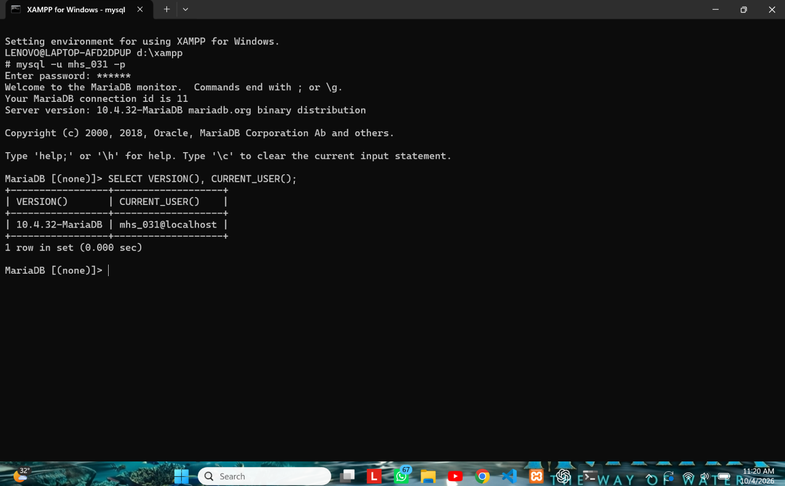
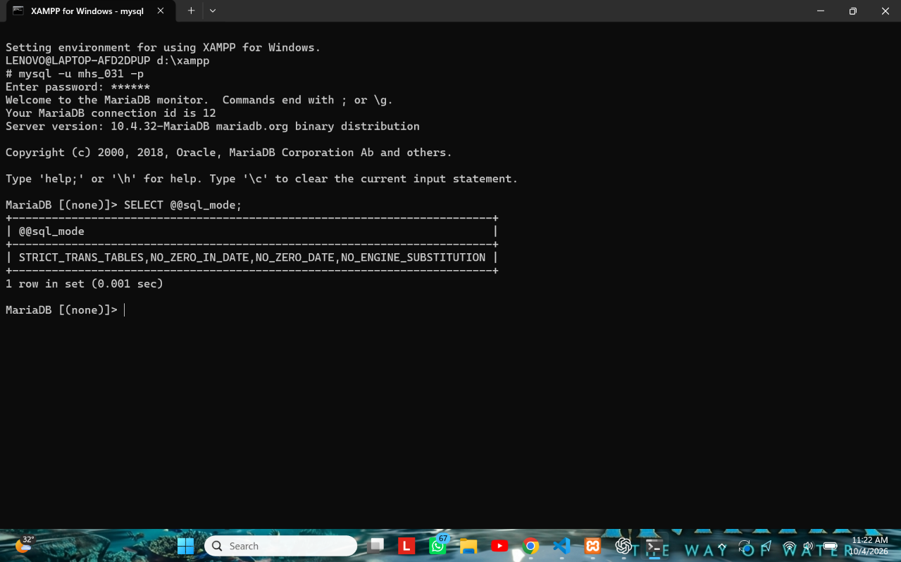
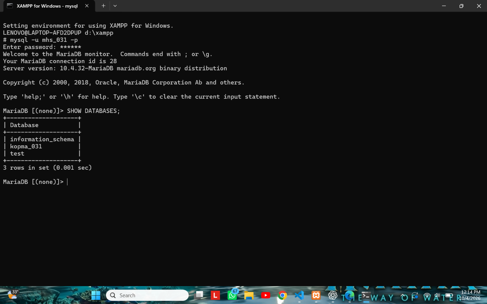
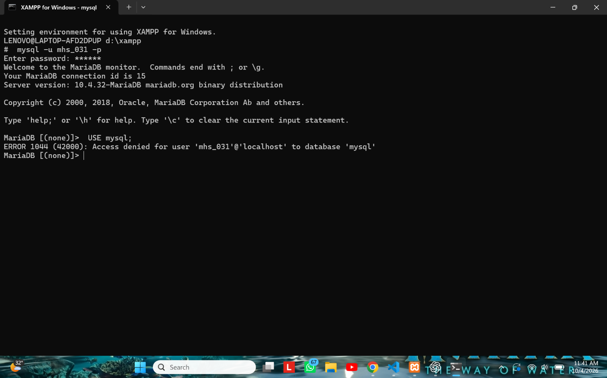
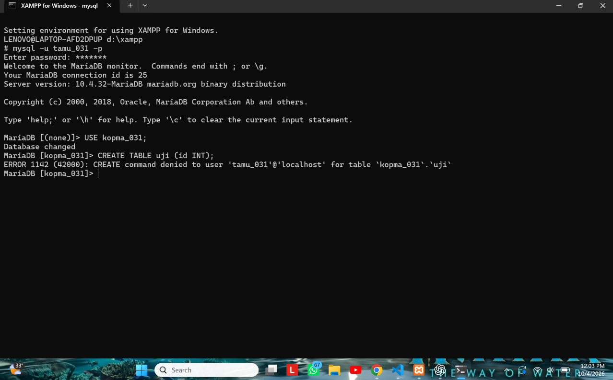
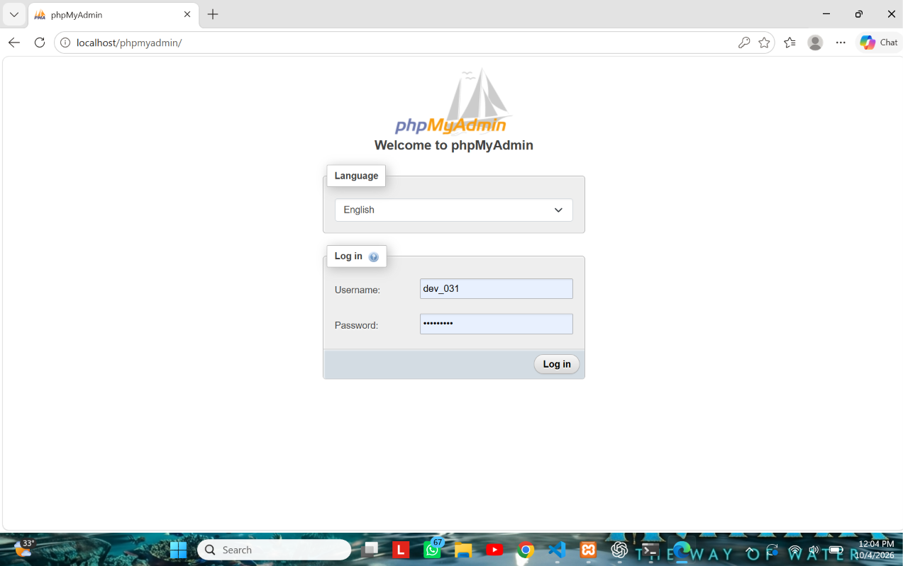
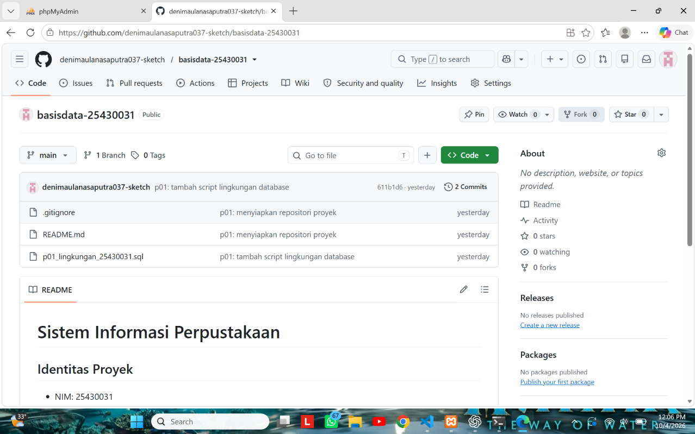
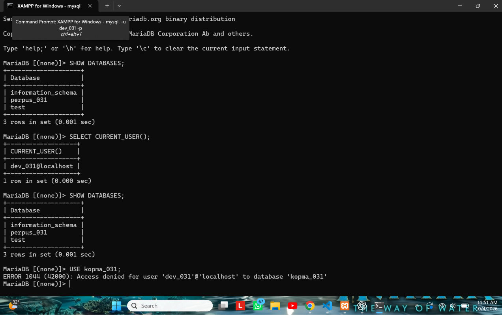

# Laporan Praktikum Basis Data - Pertemuan 1

**Lingkungan Kerja MariaDB di XAMPP dan Git**

- **Nama:** Deni Maulana Saputra
- **NIM:** 25430031
- **Kelas:** B
- **Pertemuan:** 1
- **Tanggal pelaksanaan:** 30 September 2026
- **Asisten/Dosen:** Dedi Irawan, S.Kom., M.T.I.

---

## 1. Tujuan Praktikum

Pada praktikum ini saya belajar menyiapkan lingkungan kerja basis data, yaitu:

- menyalakan MariaDB lewat XAMPP dan membaca status serta port-nya;
- masuk ke server lewat CLI dan phpMyAdmin, lalu membandingkan keduanya;
- mengamankan akun root dan membuat akun kerja yang haknya terbatas pada satu basis data;
- membuat basis data pertama dan mencatat pekerjaan ke Git dan GitHub.

## 2. Ringkasan Dasar Teori

Basis data adalah kumpulan data yang tersimpan rapi, dan DBMS adalah perangkat lunak yang mengelolanya. MariaDB memakai pola klien-server: server (`mysqld`) berjalan di port 3306, sedangkan klien seperti CLI `mysql` atau phpMyAdmin mengirim perintah dan menerima hasilnya. Karena itu, pesan yang diawali `ERROR` dan kode angka berarti koneksi sudah berhasil dan server yang menolak perintah.

Akun di MariaDB ditentukan oleh pasangan `pengguna@host`, jadi `root@localhost` dan `root@127.0.0.1` adalah dua akun yang berbeda. Prinsip yang dipakai adalah hak akses minimum (*least privilege*): root hanya untuk administrasi, sedangkan pekerjaan harian memakai akun yang hanya berhak pada satu basis data. Git mencatat perubahan berkas dalam bentuk commit sehingga proses kerja dapat dibuktikan secara bertahap.

## 3. Hasil Langkah Percobaan

Langkah yang saya kerjakan secara berurutan: menyalakan MariaDB di XAMPP Control Panel, masuk sebagai root, memberi password pada root, membuat basis data `kopma_031` dan akun `mhs_031`, mengubah phpMyAdmin ke mode cookie, lalu membuat repositori Git dan melakukan push ke GitHub. Tangkapan layar setiap langkah kunci saya tempel di bawah ini. Semua gambar memperlihatkan akun yang dipakai dan jam sistem Windows.

### 3.1 Menjalankan MariaDB dan memeriksa versi

Saya membuka XAMPP Control Panel, menekan tombol **Start** pada baris MySQL, lalu memastikan modul berlatar hijau dan kolom port menampilkan 3306. Setelah itu saya masuk lewat tombol **Shell** dan menjalankan kueri pertama:

```sql
SELECT VERSION(), CURRENT_USER();
SHOW DATABASES;
SELECT @@sql_mode;
```



**Foto 1. Versi MariaDB dan akun.** Hasil `SELECT VERSION(), CURRENT_USER();` yang menunjukkan versi server dan akun yang sedang dipakai.



**Foto 2. Mode SQL server.** Hasil `SELECT @@sql_mode;` yang harus memuat `STRICT_TRANS_TABLES`, artinya server menolak data yang tidak valid dan tidak diam-diam mengubahnya.

### 3.2 Membuat basis data dan akun kerja

Setelah root diberi password, saya membuat basis data praktik dan akun kerja yang hanya berhak pada basis data tersebut (password pada laporan ini sengaja diganti penanda):

```sql
CREATE DATABASE kopma_031
  CHARACTER SET utf8mb4 COLLATE utf8mb4_unicode_ci;

CREATE USER 'mhs_031'@'localhost' IDENTIFIED BY '<password_kerja>';
GRANT ALL PRIVILEGES ON kopma_031.* TO 'mhs_031'@'localhost';
SHOW GRANTS FOR 'mhs_031'@'localhost';
```

Kemudian saya keluar dan masuk lagi memakai akun kerja untuk melihat apa saja yang bisa diakses:

```sql
SHOW DATABASES;
USE mysql;
```



**Foto 3. SHOW DATABASES sebagai mhs_031.** Daftar basis data yang terlihat oleh akun `mhs_031`.


**Foto 4. SHOW DATABASES sebagai dev_031.** Daftar basis data yang terlihat oleh akun `dev_031`: `information_schema`, `perpus_031`, dan `test`.

### 3.3 Galat hak akses



**Foto 5. ERROR 1044.** Akun kerja menjalankan `USE mysql;` lalu ditolak karena tidak berhak pada basis data tersebut.



**Foto 6. ERROR 1142.** Akun `tamu_031` yang hanya punya hak `SELECT` mencoba `CREATE TABLE uji (id INT);` lalu ditolak (Latihan E.1).

### 3.4 phpMyAdmin dengan mode cookie

Saya membuka berkas `config.inc.php` di folder phpMyAdmin dan mengubah baris berikut, lalu membuka `http://localhost/phpmyadmin`:

```php
$cfg['Servers'][$i]['auth_type'] = 'cookie';
```



**Foto 7. Halaman masuk phpMyAdmin mode cookie.** Halaman login phpMyAdmin setelah `auth_type` diubah menjadi `cookie`.

### 3.5 Repositori Git dan GitHub

Saya membuat folder kerja `basisdata-25430031` berisi `README.md`, `.gitignore`, dan `p01_lingkungan_25430031.sql`, lalu mengirimnya ke GitHub dalam dua commit:

```bash
git add README.md .gitignore
git commit -m "p01: menyiapkan repositori proyek"
git add p01_lingkungan_25430031.sql
git commit -m "p01: tambah script lingkungan database"
git push -u origin main
```



**Foto 8. Git push pertama / GitHub.** Repositori GitHub yang memuat `p01_lingkungan_25430031.sql`, `README.md`, dan `.gitignore`.

### 3.6 Bukti Milestone Proyek 1



**Foto 9. Bukti Milestone Proyek 1.** Basis data `perpus_031` dan akun `dev_031`, serta hasil pembatasan akses (`dev_031` tidak bisa membuka `kopma_031`).

## 4. Jawaban Titik Analisis

**Titik Analisis 1: tombol "MySQL" padahal yang berjalan MariaDB**

MariaDB adalah turunan MySQL, jadi perintah dasarnya sebagian besar sama dan banyak solusi galat dari internet masih bisa dipakai. Tetapi tidak semuanya cocok. Dokumentasi MySQL masih relevan untuk SQL dasar, seperti `SELECT`, `CREATE DATABASE`, dan `GRANT`. Untuk hal yang khusus, seperti isi tabel `mysql.user`, opsi di `my.ini`, sintaks `CREATE USER IF NOT EXISTS`, dan perilaku fitur pada versi 10.4.32, saya harus merujuk ke dokumentasi MariaDB agar tidak salah.

**Titik Analisis 2: masuk tanpa opsi `-p` setelah root diberi password**

Pesan yang muncul adalah:

```text
ERROR 1045 (28000): Access denied for user 'root'@'localhost' (using password: NO)
```

Bagian yang memberi tahu bahwa klien tidak mengirim password adalah `using password: NO`. Jika password dikirim tetapi salah, bagian itu berbunyi `using password: YES`.

**Titik Analisis 3: `information_schema` terlihat, `mysql` ditolak**

`information_schema` adalah basis data virtual yang boleh dilihat semua akun, dan isinya hanya informasi tentang objek yang memang boleh diakses akun tersebut. Sebaliknya, basis data `mysql` menyimpan tabel sistem (misalnya data akun) dan `mhs_031` tidak diberi hak di sana, sehingga muncul ERROR 1044. Perbedaannya: ERROR 1044 berarti login berhasil tetapi akun tidak berhak pada basis data yang dituju, sedangkan ERROR 1045 berarti login itu sendiri gagal karena nama pengguna atau password tidak diterima.

**Titik Analisis 4: mode cookie lebih aman daripada mode config**

Pada mode `config`, password disimpan di berkas `config.inc.php` dan phpMyAdmin langsung masuk otomatis, sehingga siapa pun yang membuka alamat `localhost/phpmyadmin` atau membaca berkas itu bisa memegang akun tersebut. Pada mode `cookie`, pengguna harus mengetik password setiap kali masuk dan password tidak tersimpan di berkas konfigurasi.

**Perbedaan kode galat 1044, 1045, dan 1142**

| Kode | Artinya | Contoh dalam praktikum |
|---|---|---|
| 1045 | Login gagal (pengguna atau password ditolak) | `mysql -u root` tanpa `-p` setelah root diberi password |
| 1044 | Login berhasil, tetapi akun tidak berhak pada basis data | `mhs_031` menjalankan `USE mysql;` |
| 1142 | Login dan basis data lolos, tetapi perintah ditolak pada tabel | `tamu_031` menjalankan `CREATE TABLE uji` |

## 5. Hasil Latihan dan Modifikasi

### Latihan E.1: akun `tamu_031` dengan hak `SELECT` saja

```sql
CREATE USER 'tamu_031'@'localhost' IDENTIFIED BY '<password_tamu>';
GRANT SELECT ON kopma_031.* TO 'tamu_031'@'localhost';
```

Lalu saya masuk memakai akun tersebut dan mencoba membuat tabel:

```sql
-- mysql -u tamu_031 -p
USE kopma_031;
CREATE TABLE uji (id INT);
```

Hasilnya:

```text
ERROR 1142 (42000): CREATE command denied to user 'tamu_031'@'localhost' for table 'uji'
```

Artinya `tamu_031` bisa masuk dan membuka `kopma_031`, tetapi tidak punya hak `CREATE`, karena hanya diberi `SELECT`. Bukti ada pada Foto 6.

### Latihan E.2: skrip dapat dijalankan berulang

Skrip saya ubah dengan `IF NOT EXISTS` agar tidak galat bila dijalankan dua kali. Penanda password di skrip hanya diganti dengan password sebenarnya pada salinan lokal saat menjalankan, dan salinan itu tidak di-commit.

```sql
-- p01_lingkungan_25430031.sql
-- Password diganti penanda. Jangan commit password asli.
CREATE DATABASE IF NOT EXISTS kopma_031
  CHARACTER SET utf8mb4 COLLATE utf8mb4_unicode_ci;
CREATE USER IF NOT EXISTS 'mhs_031'@'localhost' IDENTIFIED BY '<password_kerja>';
GRANT ALL PRIVILEGES ON kopma_031.* TO 'mhs_031'@'localhost';
```

Pengujian: perintah berikut dijalankan dua kali, dan pada eksekusi kedua tidak muncul galat.

```bash
mysql -u root -p < p01_lingkungan_25430031.sql
```

## 6. Tugas Mandiri: Milestone Proyek 1

Tema proyek saya tentukan dari dua digit terakhir NIM (31), yaitu **perpustakaan**. Pekerjaan yang dilakukan:

- Membuat basis data proyek `perpus_031` dengan `utf8mb4`.
- Membuat akun `dev_031` yang hanya berhak atas `perpus_031`, lalu membuktikan akun ini tidak bisa membuka `kopma_031` (ERROR 1044, lihat Foto 9).
- Menambahkan Identitas Proyek di `README.md`.
- Menambahkan `.gitignore` yang mengecualikan `*.env` dan `kredensial*.txt`.
- Commit `README.md` dan `.gitignore` dengan pesan `p01: menyiapkan repositori proyek`, lalu push ke GitHub.

```sql
CREATE DATABASE IF NOT EXISTS perpus_031
  CHARACTER SET utf8mb4 COLLATE utf8mb4_unicode_ci;
CREATE USER IF NOT EXISTS 'dev_031'@'localhost' IDENTIFIED BY '<password_dev>';
GRANT ALL PRIVILEGES ON perpus_031.* TO 'dev_031'@'localhost';
```

### Identitas Proyek (isi README.md)

**Tema:** Perpustakaan.
**Organisasi fiktif:** Perpustakaan Cendekia DMS (inisial Deni Maulana Saputra).

Perpustakaan Cendekia DMS adalah perpustakaan kampus fiktif yang melayani peminjaman dan pengembalian buku bagi mahasiswa dan dosen. Layanannya mencakup pendataan koleksi buku, pendaftaran anggota, pencatatan peminjaman, dan penghitungan denda keterlambatan. Basis data ini akan dikembangkan bertahap pada pertemuan berikutnya.

### Keputusan desain

Akun `dev_031` dibuat terpisah dari `mhs_031` supaya tiap basis data punya akun sendiri. Dengan begitu kesalahan di satu proyek tidak merusak yang lain, sesuai prinsip hak akses minimum. Berkas `.gitignore` dibuat sejak awal agar berkas berisi password tidak ikut terkirim ke GitHub.

## 7. Pembahasan dan Kendala

Tiga galat yang saya temui di CLI, semuanya disengaja untuk pembuktian hak akses:

- **ERROR 1045**, muncul saat masuk tanpa `-p`. Cara mengatasinya: tambahkan opsi `-p` dan ketik password.
- **ERROR 1044**, muncul saat akun kerja membuka basis data `mysql`. Ini wajar karena akun tidak diberi hak di sana.
- **ERROR 1142**, muncul saat `tamu_031` membuat tabel. Ini wajar karena hanya punya hak `SELECT`.

Selain itu, setelah root diberi password, phpMyAdmin juga menampilkan galat `#1045` karena masih memakai konfigurasi lama yang masuk otomatis sebagai root tanpa password. Cara mengatasinya: ubah `auth_type` menjadi `cookie` (langkah D.5), dan password root tidak dituliskan ke dalam `config.inc.php`.

## 8. Kesimpulan

Lingkungan kerja MariaDB di XAMPP sudah siap dipakai: server berjalan, root berpassword, dan akun kerja dibatasi pada satu basis data. Saya juga memahami bahwa kode galat 1044, 1045, dan 1142 menunjukkan tahap penolakan yang berbeda. Seluruh pekerjaan tercatat di Git dan GitHub sehingga dapat dibangun ulang dari skrip.

## 9. Pernyataan Penggunaan AI

Saya menggunakan **ChatGPT dan Claude** (asisten AI dari OpenAI dan Anthropic) sebagai alat bantu dalam mempelajari dan mengerjakan **Modul 1**. AI digunakan untuk membantu memahami materi dan instruksi praktikum, menjelaskan langkah-langkah penggunaan XAMPP, MariaDB, phpMyAdmin, serta Git/GitHub, dan membantu memahami serta mencari solusi terhadap pesan galat yang muncul selama proses praktik.

AI juga digunakan untuk membantu **menyusun kerangka, merapikan, dan membuat draf laporan praktikum**, termasuk membantu menjelaskan hasil percobaan, pembahasan, dan kesimpulan berdasarkan praktik yang telah saya lakukan sendiri.

Seluruh proses instalasi, konfigurasi, eksekusi perintah, pengujian basis data, pengambilan tangkapan layar, dan pengumpulan bukti praktik dilakukan sendiri pada komputer saya. Saya juga membaca dan menyesuaikan hasil bantuan AI dengan kondisi dan hasil praktik yang sebenarnya.

**Bagian yang dibantu AI:**

- Memahami materi dan instruksi pada Modul 1.
- Mempelajari langkah penggunaan XAMPP, MariaDB, dan phpMyAdmin.
- Memahami penggunaan akun/basis data serta hak akses pengguna.
- Membantu memahami dan mengatasi pesan galat **1044, 1045, dan 1142**.
- Membantu memahami penggunaan Git dan GitHub.
- Membantu menyusun, merapikan, dan mengembangkan isi laporan praktikum.
- Membantu menyusun pembahasan dan kesimpulan berdasarkan hasil praktik.

## 10. Bukti Git

| Keterangan | Isi |
|---|---|
| Tautan repositori | https://github.com/denimaulanasaputra037-sketch/basisdata-25430031 |
| Riwayat commit | 4 commit sebelum revisi laporan |
| Commit pertama | `5a5a843` — `p01: menyiapkan repositori proyek` (`README.md`, `.gitignore`) |
| Commit kedua | `611b1d6` — `p01: tambah script lingkungan database` (`p01_lingkungan_25430031.sql`) |
| Commit ketiga | `e0451ba` — `p01: laporan praktikum` (`p01_laporan_25430031.md` dan folder `img/`) |
| Commit keempat | `600a92b` — `p01: perbaiki bukti Git laporan` |

## Checklist

**Checklist umum**

- [x] **Identitas:** nama, NIM, kelas, pertemuan ke-N, tanggal pelaksanaan, nama asisten/dosen
- [x] **Tujuan:** ditulis ulang dengan bahasa sendiri (maksimal 5 baris)
- [x] **Ringkasan teori:** pemahaman sendiri atas Dasar Teori, maksimal setengah halaman, tanpa menyalin buku
- [x] **Langkah percobaan (D):** tangkapan layar hasil langkah kunci, masing-masing diberi keterangan singkat
- [x] **Titik Analisis:** semua dijawab lengkap dengan alasan, bukan sekadar ya/tidak
- [x] **Latihan (E):** skrip/dokumen hasil latihan beserta bukti berjalan
- [x] **Tugas Mandiri (F):** berkas, bukti, dan penjelasan keputusan desain
- [x] **Pembahasan dan kendala:** galat yang ditemui, cara membacanya, dan cara mengatasinya
- [x] **Kesimpulan:** dua sampai empat kalimat dengan bahasa sendiri
- [x] **Pernyataan Penggunaan AI:** alat yang dipakai, untuk apa, dan bagian mana
- [x] **Bukti Git:** tautan repositori dan kode commit (hash) dengan pesan `p01: ...`
- [x] **Keaslian:** setiap tangkapan layar memperlihatkan akun ber-NIM dan jam sistem; nama objek memuat NIM/inisial

**Checklist khusus Pertemuan 1**

- [x] **Berkas wajib:** `p01_lingkungan_25430031.sql` (dapat dijalankan ulang), `README.md` berisi Identitas Proyek, `.gitignore`
- [x] **Bukti tangkapan layar:** `SELECT VERSION(), CURRENT_USER();`, `SELECT @@sql_mode;`, `SHOW DATABASES` sebagai `mhs_031` dan `dev_031`, galat 1044 dan 1142, halaman masuk phpMyAdmin mode cookie, `git push` pertama
- [x] **Analisis wajib:** Titik Analisis 1-4; perbedaan kode galat 1044, 1045, dan 1142
