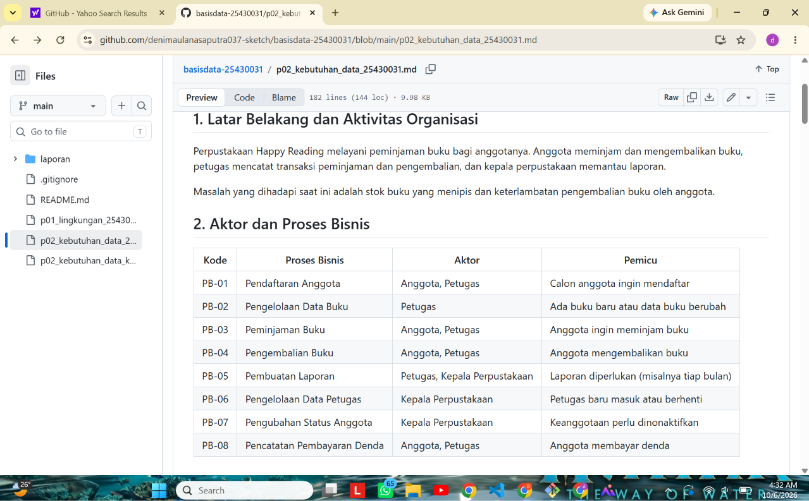
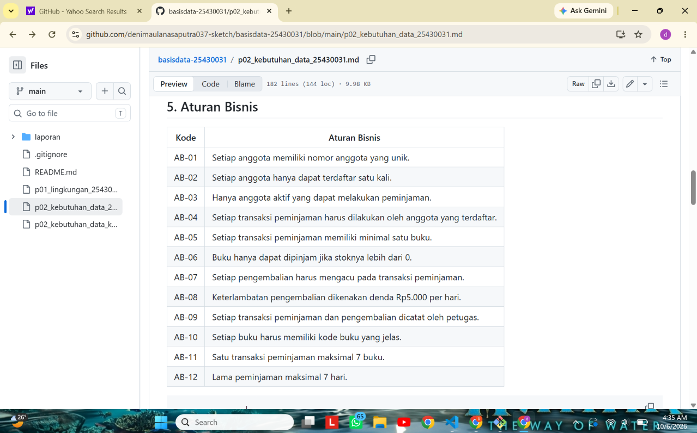
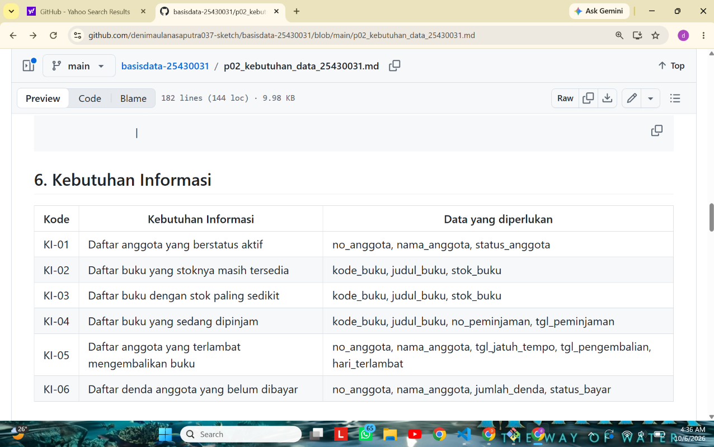
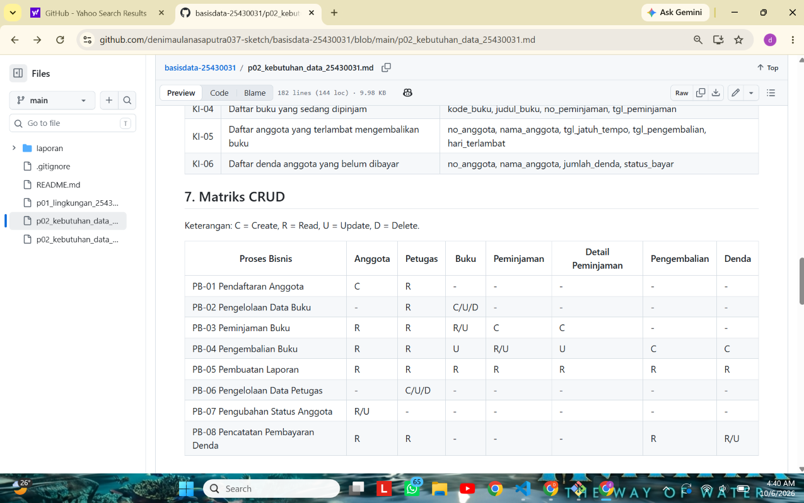
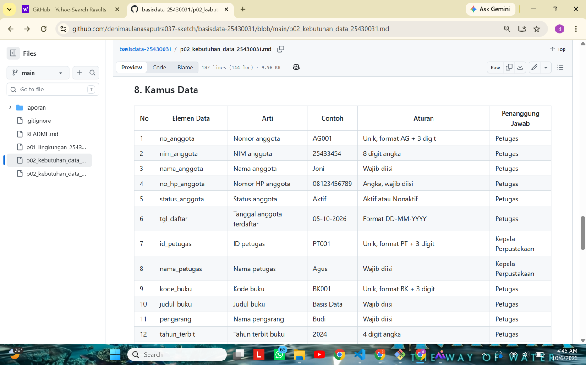
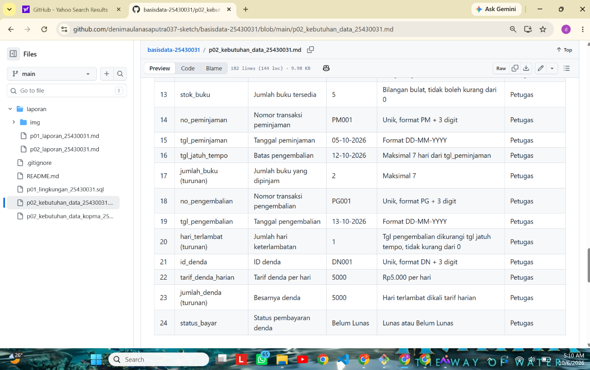

# Laporan Praktikum Basis Data - Pertemuan 2

Menggali Kebutuhan Data (Studi Kasus Kopma dan Perpustakaan Happy Reading)

- **Nama:** Deni Maulana Saputra
- **NIM:** 25430031
- **Kelas:** B
- **Pertemuan:** 1
- **Tanggal pelaksanaan:** 30 September 2026
- **Asisten/Dosen:** Dedi Irawan, S.Kom., M.T.I.

## 1. Tujuan Praktikum

Pada pertemuan ini saya belajar cara menggali kebutuhan data sebelum merancang basis data. Dari narasi, wawancara, dan dokumen sumber, saya mencari aktor, proses bisnis, entitas, aturan bisnis, kebutuhan informasi, matriks CRUD, dan kamus data. Hasilnya saya susun menjadi dokumen kebutuhan data untuk studi kasus Kopma dan untuk proyek saya sendiri, Perpustakaan Happy Reading.

## 2. Ringkasan Dasar Teori

Perancangan basis data dimulai dari analisis kebutuhan, kemudian desain konseptual, desain logis, dan desain fisik. Kesalahan pada tahap analisis adalah yang paling mahal akibatnya. Data yang tidak dicatat sejak awal, misalnya harga lama, tidak dapat dipulihkan.

Data dipandang sebagai aset organisasi. Data muncul dari aktivitas sehari-hari, memiliki pihak yang bertanggung jawab, dan harus dijaga kualitasnya. Kebutuhan dapat digali melalui wawancara, observasi, dokumen sumber, dan sistem lama, lalu dikelompokkan menjadi kebutuhan data, kebutuhan informasi, aturan bisnis, dan kebutuhan non-fungsional.

Matriks CRUD memetakan proses terhadap entitas (Create, Read, Update, Delete). Jika ada entitas yang tidak pernah di-create, berarti ada proses yang terlewat. Kamus data mencatat nama elemen, arti, contoh, aturan, dan penanggung jawabnya. Pernyataan kebutuhan yang baik harus spesifik, terukur, dan dapat diuji.

## 3. Hasil Langkah Percobaan

### 3.1 Studi kasus Kopma (langkah D.1 sampai D.7)

Hasil langkah D.2 sampai D.6 saya salin ke berkas `p02_kebutuhan_data_kopma_25430031.md` dengan mengikuti kerangka 10 bagian.

| Langkah | Hasil pada dokumen Kopma |
| --- | --- |
| D.2 Aktor dan proses bisnis | 5 proses bisnis (PB-01 sampai PB-05) dengan aktor kasir, petugas gudang, dan ketua koperasi |
| D.3 Dokumen sumber | Nota penjualan PJ-2609-0142; isinya saya pisahkan menjadi data yang disimpan dan nilai turunan (subtotal, jumlah, diskon, total, kembali) |
| D.4 Entitas dan aturan bisnis | 7 entitas kandidat dan 6 aturan bisnis (AB-01 sampai AB-06) |
| D.5 Kebutuhan informasi dan CRUD | 4 kebutuhan informasi (KI-01 sampai KI-04) dan matriks CRUD 5 proses terhadap 6 entitas |
| D.6 Kamus data dan non-fungsional | 6 elemen kamus data awal beserta penanggung jawab; sekitar 150 nota per hari, retensi 5 tahun, nomor HP hanya boleh dilihat ketua |

### 3.2 Dokumen proyek: tangkapan layar GitHub

Tangkapan layar berikut saya ambil dari tampilan GitHub untuk berkas `p02_kebutuhan_data_25430031.md` (repositori `basisdata-25430031`). Alamat berkas dan jam sistem terlihat pada setiap gambar.

**Tabel proses bisnis (Bagian 2).** Berisi delapan proses, PB-01 sampai PB-08, lengkap dengan aktor dan pemicunya.

**Tabel aturan bisnis (Bagian 5).** Berisi dua belas aturan, AB-01 sampai AB-12. AB-08 dan AB-11 memakai nilai parameter P.

**Tabel kebutuhan informasi (Bagian 6).** Berisi enam kebutuhan informasi beserta data yang diperlukan.

**Matriks CRUD (Bagian 7).** Setiap entitas memiliki huruf C pada minimal satu proses.

**Kamus data (Bagian 8), baris 1 sampai 12.**

**Kamus data (Bagian 8), baris 13 sampai 24.**

## 4. Jawaban Titik Analisis

**Titik Analisis 1: harga saat transaksi.** Harga pada data barang selalu merupakan harga terbaru, sehingga ketika harga naik, nilai lamanya tertimpa dan hilang. Jika nota hanya menyimpan kode barang dan qty, nota lama akan terbaca dengan harga baru, sehingga totalnya tidak lagi sama dengan yang dibayar pembeli saat itu. Hal ini sesuai dengan keluhan ketua koperasi yang kebingungan melihat nota lama karena harga sering naik. Oleh sebab itu, harga perlu disimpan pada setiap baris nota saat transaksi terjadi (AB-04 pada dokumen Kopma).

**Titik Analisis 2: subtotal dan total sebagai nilai turunan.**

- Alasan tidak disimpan: nilainya dapat dihitung ulang dari qty, harga, dan diskon. Jika tetap disimpan, data menjadi ganda dan dapat tidak konsisten ketika qty atau harga dikoreksi.
- Alasan total mungkin tetap disimpan: total adalah angka yang benar-benar dibayar pembeli saat itu, sehingga dapat berfungsi sebagai bukti transaksi. Laporan omzet juga lebih cepat dibuat karena tidak perlu menghitung ulang semua baris. Keputusan akhirnya akan dibahas pada Modul 4.

**Titik Analisis 3: kolom Pemasok dan status anggota.** Pada matriks CRUD Kopma, kolom Pemasok tidak memiliki huruf C. Artinya, tidak ada proses yang membuat data pemasok, padahal datanya dibaca saat memesan barang (PB-03) dan menerima barang (PB-04). Karena itu, perlu ditambahkan proses "Mengelola data pemasok" yang dijalankan petugas gudang. Status aktif anggota juga belum diubah oleh proses mana pun, sehingga perlu ditambahkan proses "Mengubah status anggota" dengan akses U pada entitas Anggota. Pada proyek perpustakaan, hal ini sudah saya tangani: PB-07 (Pengubahan Status Anggota) mengubah status anggota, dan PB-06 (Pengelolaan Data Petugas) membuat data petugas.

## 5. Hasil Latihan dan Modifikasi

### Latihan E.1: poin loyalitas Kopma

Setiap kelipatan belanja Rp10.000 bernilai 1 poin, dan 50 poin dapat ditukar dengan potongan Rp5.000. Saya berasumsi bahwa poin dihitung dari total yang dibayar setelah diskon, dengan pembulatan ke bawah. Contohnya, total nota Rp27.550 menghasilkan 2 poin.

**Elemen data baru**

| Elemen | Arti | Contoh | Aturan | Penanggung jawab |
| --- | --- | --- | --- | --- |
| saldo_poin_anggota | Poin yang dimiliki anggota | 12 | Bilangan bulat ≥ 0 | Ketua |
| poin_didapat_penjualan (turunan) | Poin yang diperoleh dari satu nota | 2 | Total dibagi 10.000, dibulatkan ke bawah | Kasir |
| poin_ditukar_penjualan | Poin yang ditukar pada satu nota | 50 | Kelipatan 50 | Kasir |
| potongan_poin_penjualan (turunan) | Potongan harga dari penukaran poin | 5000 | Poin ditukar dibagi 50, dikali Rp5.000 | Kasir |

**Aturan bisnis baru (dokumen Kopma)**

| Kode | Aturan bisnis |
| --- | --- |
| AB-07 | Setiap kelipatan Rp10.000 total belanja anggota bernilai 1 poin, dibulatkan ke bawah. |
| AB-08 | Poin hanya dapat ditukar dalam kelipatan 50, dan setiap 50 poin menjadi potongan Rp5.000. |
| AB-09 | Saldo poin tidak boleh negatif; penukaran ditolak jika saldo kurang dari poin yang ditukar. |

**Kebutuhan informasi baru**

| Kode | Kebutuhan informasi | Data yang diperlukan |
| --- | --- | --- |
| KI-05 | Saldo poin setiap anggota | Anggota |
| KI-06 | Anggota yang saldo poinnya sudah 50 atau lebih | Anggota |

**Perubahan matriks CRUD.** Pada PB-02 (Catat penjualan), akses ke Anggota berubah dari R menjadi R, U karena saldo poin bertambah dan berkurang pada setiap nota. Pada PB-05 (Laporan bulanan), kolom Anggota tetap R.

### Latihan E.2: perbaikan tiga pernyataan kabur

| Pernyataan kabur | Perbaikan yang dapat diuji |
| --- | --- |
| (a) Data anggota harus aman | Nomor HP dan NIM anggota hanya dapat dilihat oleh ketua koperasi; jika akun kasir mencoba membukanya, sistem menolak. |
| (b) Sistem harus cepat mencari barang | Pencarian barang berdasarkan kode atau nama menampilkan hasil paling lama 2 detik pada 5.000 data barang. |
| (c) Laporan stok harus akurat | Stok pada laporan sama dengan stok awal ditambah barang masuk dikurangi barang terjual, dan tidak pernah negatif (AB-03). |

## 6. Tugas Mandiri: Milestone Proyek 2

**Berkas:** `p02_kebutuhan_data_25430031.md` (organisasi: Perpustakaan Happy Reading).

**Pemeriksaan terhadap ketentuan minimum**

| Ketentuan | Hasil |
| --- | --- |
| Minimal 4 proses bisnis | 8 proses |
| Minimal 6 entitas kandidat | 7 entitas |
| Minimal 8 aturan bisnis | 12 aturan |
| Minimal 5 kebutuhan informasi | 6 kebutuhan |
| Matriks CRUD tanpa entitas yatim | Semua entitas punya C |
| Kamus data minimal 20 elemen dengan penanggung jawab | 24 elemen |
| Non-fungsional dan data pribadi | NFR-01 sampai NFR-05 dan tabel hak akses data pribadi |
| Dokumen sumber fiktif dan pembedahannya | Formulir pendaftaran anggota |

**Perhitungan parameter P.** NIM 25430031, dua digit terakhirnya 31. P = (31 mod 9) + 1 = 4 + 1 = **5**.

- Batas maksimal item per transaksi = P + 2 = 7 buku (dipakai di AB-11).
- Denda harian = P ribu rupiah = Rp5.000 per hari (dipakai di AB-08).
- Perkiraan volume harian = 40 + (5 x P) = 65 transaksi (dipakai di NFR-05).

**Keputusan desain**

- Stok saya simpan per judul (`stok_buku`), bukan per eksemplar, agar model tetap sederhana untuk skala praktikum. Konsekuensinya, kerusakan atau kehilangan satu eksemplar tidak dapat dicatat secara terpisah.
- Peminjaman saya pisahkan dari Detail Peminjaman karena satu transaksi dapat memuat beberapa buku (maksimal 7).
- `tarif_denda_harian` saya simpan pada entitas Denda, tidak hanya sebagai aturan umum, agar denda lama tidak ikut berubah jika tarifnya diganti kelak. Prinsipnya sama dengan harga saat transaksi pada Kopma.
- `jumlah_buku`, `hari_terlambat`, dan `jumlah_denda` saya tandai sebagai elemen turunan karena dapat dihitung dari data lain.
- Data petugas dikelola oleh Kepala Perpustakaan, sedangkan data anggota, buku, dan transaksi dikelola oleh Petugas.

## 7. Pembahasan dan Kendala

1. **`fatal: not a git repository`.** Pesan ini muncul ketika saya menjalankan `git status` di folder utama akun, bukan di folder repositori. Artinya, Git hanya dapat bekerja di dalam folder yang memiliki `.git`. Saya mencari lokasi folder tersebut dengan `find`, lalu masuk ke `/d/perpus_031` dengan `cd`. Setelah itu, `git status` berjalan normal.
2. **`cd: No such file or directory`.** Jalur yang saya ketik ternyata tidak ada. Di Git Bash, drive D ditulis `/d/...`, bukan `D:\...`. Saya memperbaikinya dengan memakai jalur dari hasil `find`.
3. **Tabel matriks CRUD terpotong pada tangkapan layar.** Penyebabnya, tampilan browser sedang diperbesar sehingga tabel yang lebar tidak muat. Saya memperkecil zoom (Ctrl+minus) sampai seluruh tabel terlihat dalam satu layar.
4. **Perbedaan Kopma dan proyek.** Kopma berpusat pada penjualan dan stok barang, sedangkan perpustakaan berpusat pada peminjaman, pengembalian, dan denda. Karena itu, aturan bisnis dan kamus datanya saya susun dari proses masing-masing, bukan disalin dari salah satunya.

## 8. Kesimpulan

Analisis kebutuhan membantu saya menemukan data apa saja yang harus disimpan sebelum merancang tabel, misalnya harga saat transaksi yang mencegah riwayat nota ikut berubah. Matriks CRUD berguna untuk memeriksa proses yang terlewat, seperti pengelolaan pemasok pada Kopma. Kamus data dengan kolom penanggung jawab membuat setiap data memiliki pemilik yang jelas. Kebutuhan yang dirumuskan dengan angka dan kondisi juga lebih mudah diuji daripada kalimat yang terlalu umum.

## 9. Pernyataan Penggunaan AI

Selama mengerjakan pertemuan ini, saya menggunakan Claude (Anthropic) untuk: (a) membantu menyusun draf bagian-bagian dokumen kebutuhan data (kerangka, tabel, dan kamus data), yang kemudian saya periksa dan sesuaikan; (b) memeriksa kelengkapan dokumen terhadap ketentuan minimum pada buku praktikum; (c) menjelaskan perintah Git dan cara mengambil tangkapan layar; dan (d) membantu menyusun kerangka laporan ini.

## 10. Bukti Git

- Repositori: https://github.com/denimaulanasaputra037-sketch/basisdata-25430031

| Commit | Pesan | Hash |
| --- | --- | --- |
| Dokumen Kopma | `p02: dokumen kebutuhan data kopma` | dd5f4a1 |
| Dokumen proyek | `p02: dokumen kebutuhan data perpustakaan` | 2256f2d |
| Laporan | `p02: laporan pertemuan 2` | 257a26b

## Checklist

**Checklist umum**

- [x] Identitas (nama, NIM, kelas, pertemuan, tanggal, asisten/dosen)
- [x] Tujuan, bahasa sendiri, maksimal 5 baris
- [x] Ringkasan teori, maksimal setengah halaman
- [x] Langkah percobaan (D) dengan tangkapan layar dan keterangan
- [x] Titik Analisis 1 sampai 3 dengan alasan
- [x] Latihan (E.1 dan E.2)
- [x] Tugas Mandiri (F): berkas, bukti, dan keputusan desain
- [x] Pembahasan dan kendala
- [x] Kesimpulan, dua sampai empat kalimat
- [x] Pernyataan penggunaan AI (lengkapi kalimat terakhir di Bagian 9)
- [x] Bukti Git (isi hash commit laporan setelah commit)
- [x] Keaslian: tangkapan layar memperlihatkan jam sistem dan nama repositori ber-NIM

**Checklist khusus Pertemuan 2**

- [x] Berkas wajib: `p02_kebutuhan_data_kopma_25430031.md` dan `p02_kebutuhan_data_25430031.md`
- [x] Bukti tangkapan layar: tabel PB, AB, KI, matriks CRUD, dan kamus data di berkas proyek
- [x] Analisis wajib: Titik Analisis 1 sampai 3, perhitungan parameter P, dan perbaikan tiga pernyataan kabur